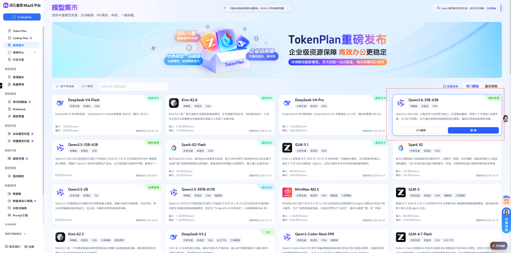
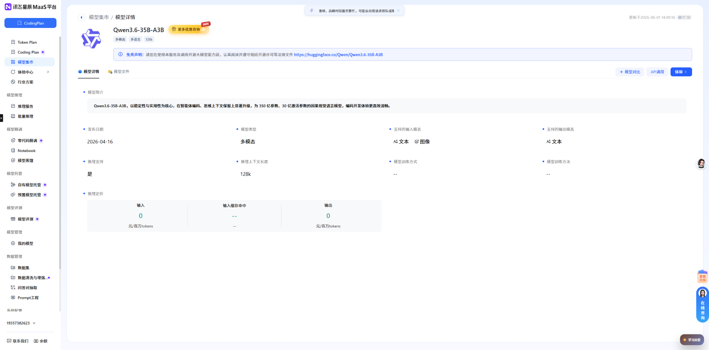
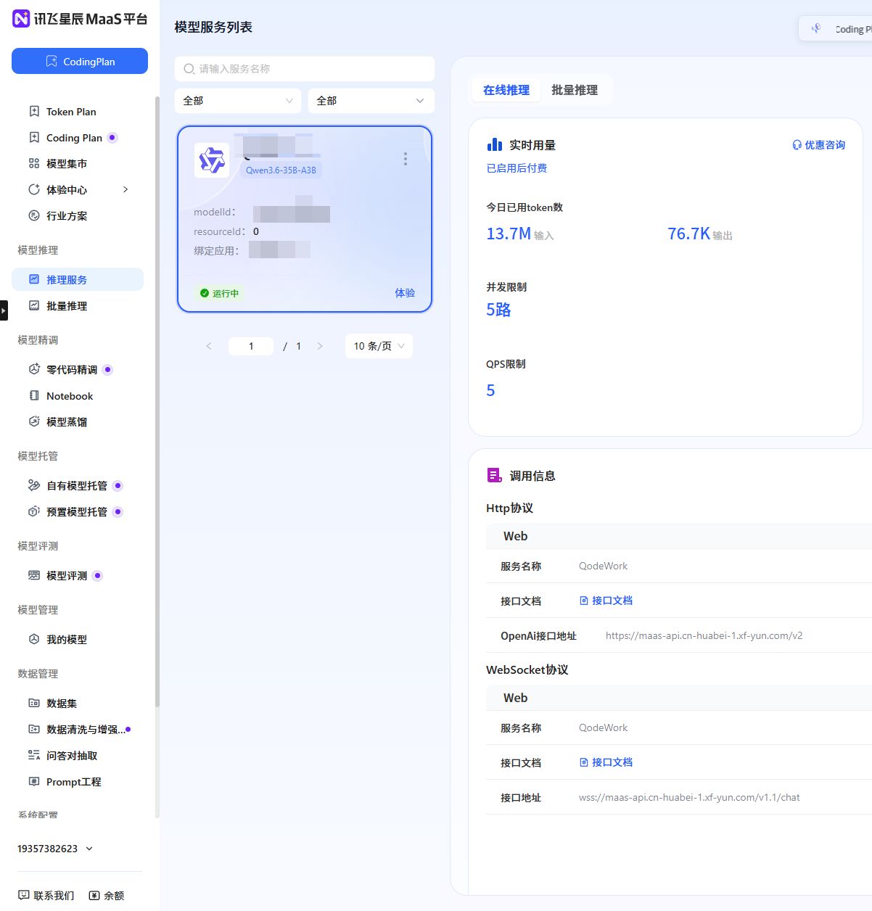

最近在讯飞星辰 MaaS 平台看到 `Qwen3.6-35B-A3B` 可以限时免费调用，而且支持 OpenAI 兼容接口。对于想折腾 AI 编程工具、本地客户端、OpenAI 兼容代理，或者只是想白嫖一点大模型 API 额度的朋友来说，这个入口还是挺香的。

这篇文章记录一下完整流程：从模型集市找到免费 Qwen 模型，到创建推理服务，再到复制 `modelId`、接口地址和 API Key。

> 说明：免费模型、免费时间、额度和限流规则可能会变化，最终以讯飞星辰 MaaS 控制台页面显示为准。  
> 另外，API Key 千万不要放到公开仓库、博客截图或前端代码里。

## 一、进入讯飞星辰 MaaS 模型集市

先打开讯飞星辰 MaaS 平台的模型集市：

```text
https://maas.xfyun.cn/modelSquare?ch=MaaS-jgkol-l7P2y
```

进入后，在左侧菜单选择 **模型集市**。页面里能看到很多模型卡片，例如 DeepSeek、Kimi、GLM、Spark、Qwen 等。

在右侧找到 `Qwen3.6-35B-A3B`，卡片右上角会显示 **限时免费**，然后点击卡片里的 **API调用**。



这里注意，不要只是点"体验"。如果你想拿到接口信息，需要点的是 **API调用**。

## 二、进入模型详情页，确认模型信息

进入模型详情页后，可以先看一下模型基础信息。

我这里看到的是：

- 模型名称：`Qwen3.6-35B-A3B`
- 模型类型：多模态
- 推理上下文长度：`128k`
- 支持输入模态：文本、图像
- 支持输出模态：文本
- 推理价格：输入 `0 元/百万tokens`，输出 `0 元/百万tokens`



页面右侧有 **API调用** 按钮。确认是自己要用的模型后，继续点击 **API调用** 进入服务配置。

## 三、创建模型推理服务

点击 **API调用** 后，会进入模型服务配置流程。

这一步一般需要填写：

- 服务名称：自己起一个名字即可，例如 `QodeWork`
- 授权应用：选择一个已有应用
- 如果没有应用，就先创建应用，再回来绑定

创建完成后，可以在左侧菜单进入：

```text
模型推理 -> 推理服务
```

然后在模型服务列表里找到刚刚创建的服务。

## 四、复制调用信息

在推理服务详情页右侧，可以看到服务的实时用量和调用信息。

这里重点复制三样东西：

1. `modelId`
2. OpenAI 接口地址
3. API Key



### 1. modelId

`modelId` 在左侧服务卡片中可以看到。这个不是模型展示名称，而是实际调用时要填到 `model` 字段里的值。

比如我这里示例是：

```text
xopqwen36v35b
```

后面在支持 OpenAI 兼容接口的软件里，模型名称就填这个 `modelId`。

不要填成：

```text
Qwen3.6-35B-A3B
```

很多人接入失败，就是因为把展示名称当成了接口里的模型名。

### 2. OpenAI 兼容接口地址

在调用信息里可以看到 OpenAI 接口地址：

```text
https://maas-api.cn-huabei-1.xf-yun.com/v2
```

很多软件里这个字段可能叫：

- Base URL
- API Base
- OpenAI Base URL
- OpenAI Compatible Endpoint
- 自定义 OpenAI 地址

填的时候只填到 `/v2`，不要自己再额外拼 `/chat/completions`。

### 3. API Key

API Key 在服务接口认证信息里复制。

这里一定要注意：**不要把真实 API Key 写进博客、GitHub 仓库、前端项目或公开截图里。**

如果你要写教程，建议像我这样把关键字段打码，只展示接口地址和配置方法即可。

## 五、在 OpenAI 兼容工具里怎么填

如果你的工具支持 OpenAI 兼容接口，一般这样配置：

```text
Base URL: https://maas-api.cn-huabei-1.xf-yun.com/v2
API Key: 你的 API Key
Model: xopqwen36v35b
```

如果你领取的是别的模型，比如 `Qwen3.5-35B-A3B`，就把 `Model` 改成对应服务页面显示的 `modelId`。

通用 JSON 配置大概是这样：

```json
{
  "baseURL": "https://maas-api.cn-huabei-1.xf-yun.com/v2",
  "apiKey": "你的 API Key",
  "model": "xopqwen36v35b"
}
```

## 六、用 Python 简单测试

如果想先确认接口是否能正常调用，可以用 OpenAI SDK 简单测一下。

先安装依赖：

```bash
pip install openai
```

然后新建测试文件：

```python
from openai import OpenAI

client = OpenAI(
    api_key="你的 API Key",
    base_url="https://maas-api.cn-huabei-1.xf-yun.com/v2"
)

response = client.chat.completions.create(
    model="xopqwen36v35b",
    messages=[
        {"role": "user", "content": "你好，简单介绍一下你自己。"}
    ],
    temperature=0.7,
    max_tokens=1024
)

print(response.choices[0].message.content)
```

如果能正常返回内容，就说明下面三项都没问题：

- API Key 正确
- Base URL 正确
- modelId 正确

## 七、常见问题

### 1. 为什么我填 Qwen3.6-35B-A3B 报错？

因为 `Qwen3.6-35B-A3B` 是模型展示名称，实际调用时要填控制台生成的 `modelId`。

例如：

```text
xopqwen36v35b
```

具体以你的服务页面显示为准。

### 2. OpenAI 接口地址后面要不要加 /chat/completions？

一般不用。

在大多数 OpenAI 兼容客户端里，只需要填：

```text
https://maas-api.cn-huabei-1.xf-yun.com/v2
```

客户端会自动拼接后面的接口路径。

### 3. 能不能把 API Key 直接写进前端项目？

不建议，千万不要这样做。

前端代码会暴露给用户，API Key 很容易被别人扒出来。更安全的方式是：

1. API Key 放在后端环境变量里
2. 前端请求自己的后端接口
3. 后端再去请求讯飞星辰 MaaS

### 4. Qwen3.5-35B-A3B 也是一样的流程吗？

是的，流程基本一样。

只要在模型集市里找到 `Qwen3.5-35B-A3B`，点击 **API调用**，创建服务后复制对应的 `modelId`、OpenAI 接口地址和 API Key 即可。

### 5. 普通 MaaS 和 Coding Plan 是不是同一个地址？

不是一个概念。

这篇文章讲的是模型集市里的普通 MaaS 推理服务，OpenAI 接口地址是：

```text
https://maas-api.cn-huabei-1.xf-yun.com/v2
```

如果你使用的是 Coding Plan 相关服务，页面可能会显示另一套接口地址，不要混用。

## 八、总结

整体流程其实很简单：

1. 打开讯飞星辰 MaaS 模型集市
2. 找到 `Qwen3.6-35B-A3B`
3. 点击 **API调用**
4. 创建或绑定应用
5. 进入 **模型推理 -> 推理服务**
6. 复制 `modelId`、OpenAI 接口地址和 API Key
7. 在支持 OpenAI 兼容接口的工具里填写

目前我这里看到的关键信息是：

```text
模型：Qwen3.6-35B-A3B
OpenAI 接口地址：https://maas-api.cn-huabei-1.xf-yun.com/v2
示例 modelId：xopqwen36v35b
价格：输入 0 元/百万tokens，输出 0 元/百万tokens
```

免费额度和活动时间可能随时变化，想薅的朋友建议先去控制台看一下当前是否还显示 **限时免费**。
